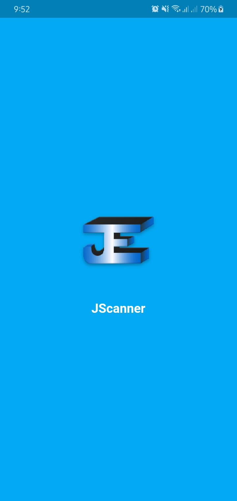
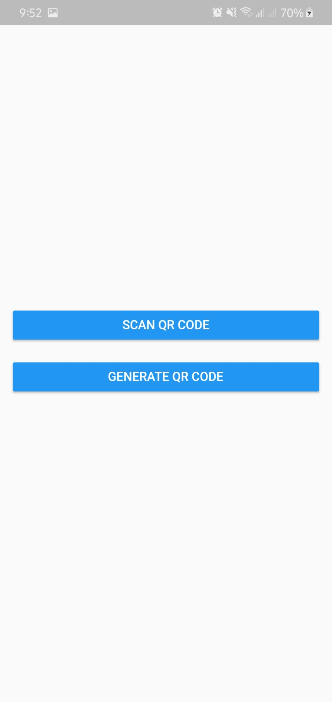
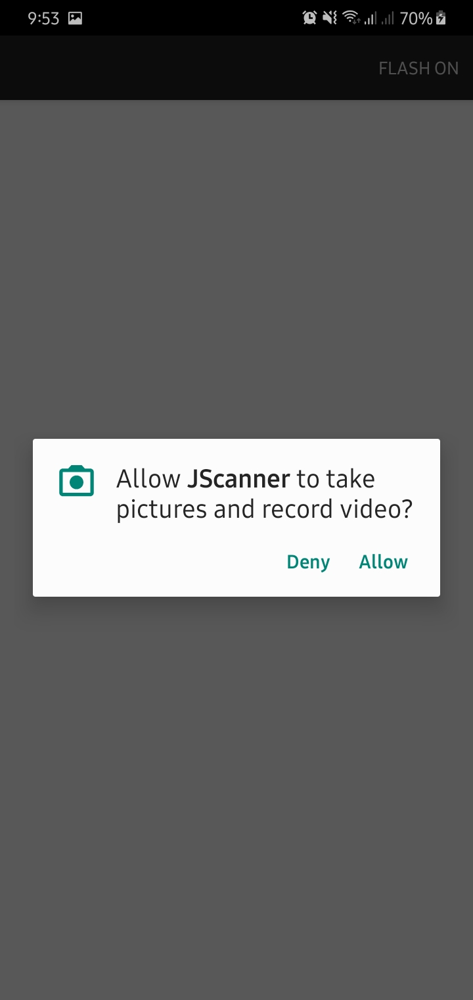
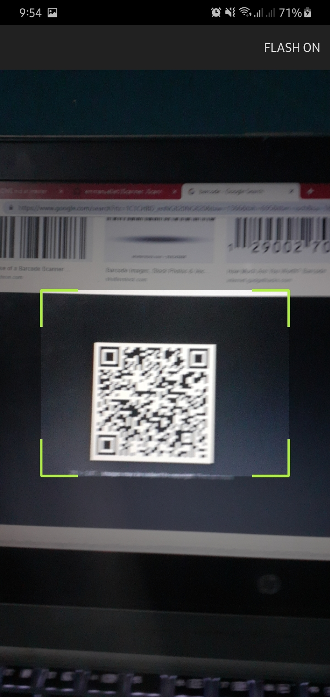
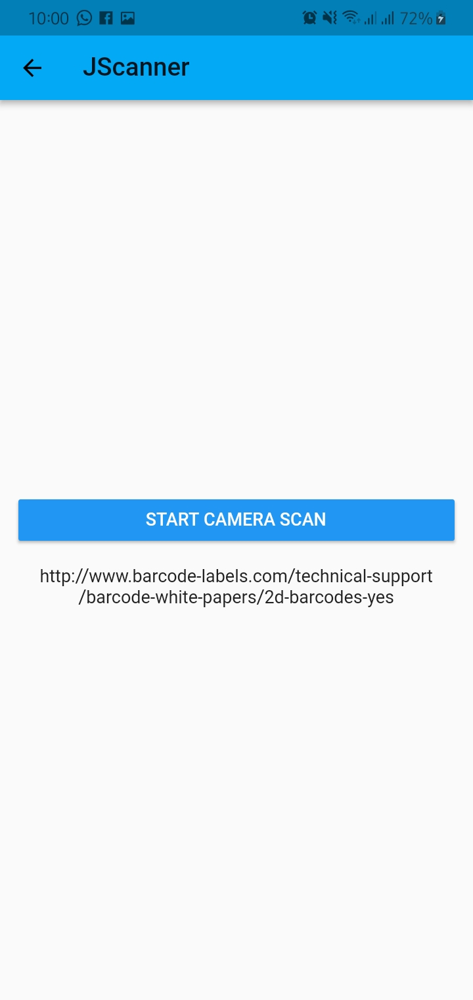
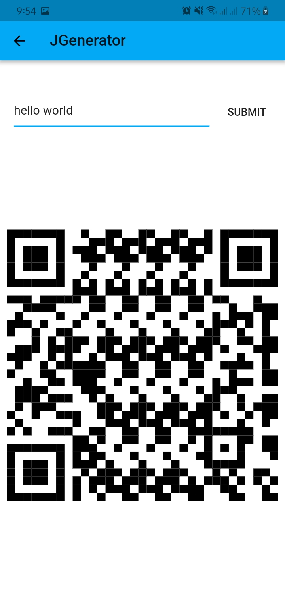

# JScanner

JScanner is an app that **scan** and **generate** barcode for security purpose. JScanner was written with **Flutter** (Cross-Mobile Platform Development Kit) and compiled in **Kotlin**. Get The **APK** on [Google Drive](https://drive.google.com/open?id=1qFi0NkM3-16NfqXK7cWKVfqO07y11IRD)

## Features

Here is a list of features that it has:

- Scan Barcode: the user can scan any **barcode**.
- Generate Barcode: the user can generate **barcode**.

## Screenshots

## Packages Used

Here is a list of dependencies used:

- [qr_flutter](https://pub.dev/packages/qr_flutter)
- [barcode_scan](https://pub.dev/packages/barcode_scan)
- [path_provider](https://pub.dev/flutter/packages?q=path_provider)
